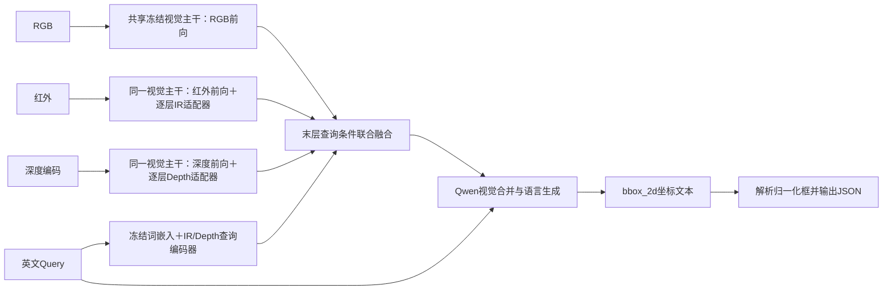

# AIC 多模态赛题拆解与当前工程阅读报告

日期：2026-09-08。工作区：`F:\AIC`。工程：`F:\AIC\code`，分支 `public-v1`，提交 `8c05a782272aea00bb2b9e3ee7570d098da36785`。

本轮任务是接手阅读、理解与报告。已阅读根目录 AGENTS.md、官方比赛材料、全部当前工程源码及配置测试，并核对本地数据结构与提交包。没有修改模型源码、配置或既有预测，没有训练、下载模型或执行比赛提交。本报告以当前文件为准；8 月和 9 月 5 日报告中的旧代码问题不能直接套用到新提交。

## 1. 核心判断

赛题要求从空间对齐的 RGB、热红外、深度图和英文 Query 中，找到描述所指的唯一目标，输出 RGB 坐标系下的归一化边界框，以 ACC@0.5 为最终成绩。

当前 TriGround 已具备数据转换、人工审核、弱监督构造、分阶段训练、模态消融、模型选择与比赛提交的完整代码链。核心主线是冻结 Qwen3-VL-2B-Instruct，分别学习红外和深度适配器，再进行查询条件联合融合，由 Qwen 自回归生成框坐标。

README 报告的历史比赛成绩为：RDT 弱监督路线 0.6404，并行适配器后融合路线 0.6785，后者高 3.81 个百分点，是 README 当前推荐路线。这是整条流水线的比较，不能单独证明某个模态、适配器或融合器贡献了多少。

最新提交已实现 Query 位置编码 A/B 实验，并修正主训练链的 ACC 选模、最优权重重载、Joint Fusion 模态缩放诊断等问题。但本地没有新实验训练日志、权重或结果，工程交接文档也明确标注正式实验尚未执行。现在应称为“实验实现已完成、效果待验证”。

本轮新发现：官方初赛数据中的 97 组深度文件实际为 640×360、RGB 模式的 JPEG，涉及 177 条 Query；其余 1903 组为 1920×1080、16 位单通道。代码统一按第一通道毫米深度处理，存在输入语义不匹配风险，尚不能从文件头确定这 97 组的真实编码含义。

## 2. 阅读范围与仓库状态

### 2.1 官方材料

`contest/` 共 41 个文件：

- 核心赛题 PDF 共 9 页：全文提取，并重新渲染后逐页查看，核对任务、公式、数据类型、约束和交付要求。
- 两份 HTML：完整读取正文，分别为赛题说明与算法挑战赛通用通知。
- 技术报告 DOCX：读取全文及表格结构，确认七部分大纲要求。
- 37 个附属网页资源：遍历分类并扫描脚本、样式和 SVG 文本；查看赛程图、任务示意图、IoU/ACC 公式图和题目横幅。其余为网站导航、动画、统计、Logo 与二维码等资源。

另读取 `chores/参赛选手承诺书.pdf`；四份签字图片只确认存在。

主要来源：

- [官方赛题 PDF](F:/AIC/contest/基于大模型的多模态视觉理解与推理.pdf)，尤其第 2–4、6–9 页。
- [赛题网页快照](<F:/AIC/contest/全球校园人工智能算法精英大赛 多模态赛道.html>)。
- [赛道通知快照](<F:/AIC/contest/全球校园人工智能算法精英大赛 智青春·算未来.html>)。
- [技术报告大纲](F:/AIC/contest/【技术报告】基于大模型的多模态视觉理解与推理-0415.docx)。

本轮使用已安装的 PDF、Documents 技能进行本地材料读取；不需要另行安装技能。

### 2.2 工程源码

当前 Git 跟踪文件 106 个，其中：

| 内容 | 数量 | 阅读方式 |
| --- | ---: | --- |
| Python 源码 | 80 | 主 Agent 与两名代码审读 Agent 分工完整阅读；含测试 |
| 核心包 `src/mm_grounding` | 10 | 数据、模型、融合、训练、指标、框、LoRA、检查点、配置及包入口 |
| 工具 Python | 45 | 数据、审核、诊断、提交、下载及实验辅助 |
| 测试 Python | 23 | 74 个测试函数，已阅读测试意图与断言 |
| 训练/评估入口 | 2 | `train.py`、`evaluate.py` |
| YAML 配置 | 11 | 两条已有路线及新增 A/B 配置 |
| 工具 HTML | 2 | 两套人工审核页面 |
| 其余工程文件 | 13 | Markdown、依赖、许可、启动脚本、发布清单与忽略配置等 |

80 个 Python 文件合计 10,380 行。所有当前受跟踪路径列于文末，便于后续核对阅读范围。缓存、Git 内部对象、图片与压缩结果不计为工程源码。

根目录 `F:\AIC` 不是 Git 仓库；`code/` 是实际 Git 仓库，阅读前后工作树干净。根 `.gitignore` 已包含 `AGENTS.md`，本轮未修改该规范文件。

### 2.3 工作区用途

| 目录 | 当前内容 | 作用 |
| --- | --- | --- |
| `contest/` | 41 个本地官方材料和网页资源 | 赛题事实与规则依据 |
| `code/` | TriGround 当前工程 | sql 路线的训练、评估、数据与提交工具 |
| `data/` | 6000 张官方初赛图像与 1 份 Query JSON，约 13.1 GB | 本地推理输入；不是可训练标注集 |
| `results/` | 3 份 ZIP、zjq 预测与原始输出各 1 份 JSON | 已有推理产物 |
| `docs/research/` | 本轮之前 5 份阶段报告 | 赛题调查、zjq 推理、TriGround 阅读及审计历史 |
| `chores/` | 承诺书及签字图片 | 参赛事务 |
| `tmp/` | 材料阅读与渲染中间文件 | 临时核对用途 |

根数据和结果目录中已有内容，不能再沿用 8 月 11 日交接中的“没有数据、code 为空”。当前本地没有 TriGround `.pt` 权重、Qwen 主干、`code/runs`、`code/data` 或配置所需的 `city_detection_prepared` 外部训练目录。

## 3. 赛题具体要求

### 3.1 输入输出与计分单位

一条评测样本由三张对齐图像和一条英文描述组成。一个图像组可以有多个 Query，每个 Query 对应一个唯一目标。因此计分单位是 Query，不是图片组。

| 输入 | 官方定义 | 解题意义 |
| --- | --- | --- |
| RGB | 三通道 uint8，0–255 | 颜色、纹理、类别、动作与外观；最终框的坐标参考 |
| Infrared | 三通道 uint8，近似灰度堆叠；越亮越热 | 弱光条件下的热目标与轮廓信息，不具有普通彩色语义 |
| Depth | 单通道 uint16，毫米；约 0.3–20 m 可感知，0 或过小为无效 | 距离、前后关系和几何信息；必须区分无效值 |
| Query | 描述目标的英文句子 | 指定要找的实体、属性、动作、位置或关系 |

目标框为 `[x1,y1,x2,y2]`，x 除以 RGB 图宽，y 除以 RGB 图高，需满足：

```text
0 <= x1 < x2 <= 1
0 <= y1 < y2 <= 1
```

评分公式：

```text
IoU = 预测框与真值框的交集面积 / 并集面积
ACC@0.5 = IoU >= 0.5 的有效 Query 数量 / 全部 Query 数量
```

反向、越界、NaN 和无效空框直接无效。IoU 从 0.49 到 0.51 能改变主指标，从 0.8 到 0.9 不会额外加分；平均 IoU 适合诊断与同分比较，但不能代替官方主指标。

### 3.2 题目能力拆解

| 子问题 | 需要解决的具体问题 | 对工程的要求 |
| --- | --- | --- |
| 输入与对齐 | 图像路径、尺寸、深度单位、无效区域是否正确 | 正确读取三模态，处理图像时保持对应关系 |
| 语言理解 | 目标是谁，参照物是谁，属性与动作约束是什么 | 区分类别词与关系词，保留词序和角色 |
| 目标区分 | 同类、相似外观、遮挡、小目标如何区分 | 既能识别目标，又能选择 Query 指定的那一个 |
| 空间推理 | 左右、前后、最近最远、序数、目标计数 | 结合图像空间、深度及语言描述推理 |
| 模态互补 | 某种模态缺失、噪声大或质量差时如何处理 | 融合辅助信息，并避免不可靠信息破坏 RGB 能力 |
| 定位输出 | 找到正确对象后能否给出足够准确的框 | 关注 IoU 0.5 阈值附近的错误与输出合法性 |
| 实验证据 | 增益是否真实、来自哪一步 | 独立验证、同条件对比和逐样本分析 |

这是视觉指代定位问题。仅做类别检测不能解决“同类中的哪一个”；只把三张图输入大模型也不能证明模型实际利用了红外或深度。官方列出的 CLIP、跨注意力、IoU 损失等属于参考解题思路，不是要求逐项照搬的固定架构。

### 3.3 提交与比赛约束

- 初赛、复赛提交预测结果 JSON 的 ZIP，只修改/填入 `bbox`，保留 Query ID 及其他字段。
- 半决赛额外提交完整数据预处理、训练与推理代码，模型文件或下载链接、环境与加载说明，以及不限页数的 PDF 技术报告。
- 技术报告大纲：算法概述（300–500 字）、实现方案、创新点、问题与思考、过程进度表、团队分工、解题参考。
- 总决赛要求以组委会后续通知为准。
- 禁止以商业闭源大模型在线推理 API 生成比赛预测，禁止人工标注测试目标或人工生成测试预测。
- 外部公开训练数据允许使用，但需在技术报告中说明来源、用法和预处理。
- 官方测试集只能用于推理，不得训练、标注、篡改或泄露。
- 赛事不限制训练算力，也不提供算力。材料中的软件版本是推荐值，网页有漏字，应以 PDF 原文核对。

本地 4 月网页快照的赛程图写明：9 月 10 日报名及初赛结果截止，9 月 11 日公布复赛数据，9 月 12 日开始提交复赛结果，10 月 10 日前公布复赛成绩并开始提交半决赛结果，11 月中下旬总决赛。这些是本地材料记录，本轮未核验后续公告或报名系统，不能当作已确认无变更的实时日程。

本地材料未给出官方基线具体成绩、各阶段提交次数/大小上限、半决赛最终测试环境与时限；不能自行补全。未发现官方带标签训练集。

## 4. 当前数据与已有提交的本地核对

### 4.1 官方初赛输入

实际读取 `data/初赛数据集-基于大模型的多模态视觉理解与推理/queries/queries.json`：

- 9555 条 Query；每条含 `visible/infrared/depth/query`，原文件没有 `bbox` 字段。
- 每种图像有 2000 个唯一引用，所有引用文件均存在。
- 总计 6000 张图像，其中 5709 PNG、291 JPG。
- 本轮只在本地检查 JSON 结构、文件引用及图像头，未展示或上传测试图像/查询内容。

| 图像组 | 组数 | RGB / IR | Depth |
| --- | ---: | --- | --- |
| 高分辨率组 | 1903 | 1920×1080，RGB 模式 | 1920×1080，I;16 模式 |
| 低分辨率组 | 97 | 640×360，RGB 模式 | 640×360，RGB 模式，JPEG |

97 组低分辨率图像关联 177 条 Query。文件头能证明编码格式不同，不能证明彩色深度的物理含义。当前 `data.py:17–29` 对三通道深度直接取第一通道，再除以 `depth_scale=1000`；如果输入通道是 8 位显示值，它会被解释为至多 0.255 米，而非可直接恢复的毫米距离。需要厘清数据编码后，才能评价这一预处理是否合适；本轮没有擅自转换测试文件或调整模型。

### 4.2 三份 ZIP

| 文件 | Query 数 | ID 集合 | 非 bbox 字段 | 框有效性 | 整图框数 |
| --- | ---: | --- | --- | --- | ---: |
| `competition_prelim_predictions.zip` | 9555 | 完全匹配 | 全部保留 | 0 非法 | 9 |
| `competition_prelim_predictions_triground_rdt_manual_ft1.zip` | 9555 | 完全匹配 | 全部保留 | 0 非法 | 6 |
| `zjq_stage2_official_test_submission.zip` | 9555 | 完全匹配 | 全部保留 | 0 非法 | 3 |

每个 ZIP 均只含一个 JSON。zjq ZIP 内容与旁边的预测 JSON 相同，原始输出 JSON 也有 9555 条。两份 TriGround 命名结果保留源 ID 顺序；zjq 的键顺序不同，但 ID 和记录内容对应正确。官方没有明文要求 JSON 对象键排序，不能据此判定 zjq 提交不合规；当前提交工具采用更严格的保序约定。

“整图框数”不等于已确认的解析失败数：模型本身也可能生成整图框。必须结合每次运行的解析日志才可归因。ZIP 格式合法也不代表已经提交成功或成绩正确。没有官方测试标签，不能在本地复算 ACC。

zjq 的历史推理记录来自另一份云端 Qwen3-VL-2B LoRA 工程；本地只有其结果与记录，不能用当前 TriGround 源码替代对那份完整工程的审计。

## 5. TriGround 核心架构与数据流

### 5.1 模块分工

| 模块 | 职责 |
| --- | --- |
| `config.py` | 模型、数据、阶段、训练配置及组合约束 |
| `data.py` | JSON/JSONL 清单、图像预处理、Query 分词、对话监督 |
| `adapters.py` | 旧融合、RDT 逐层提示、并行适配器、Query 编码、联合可靠性融合 |
| `model.py` | 将融合接入 Qwen 视觉前向，控制训练参数，管理可选框头与 LoRA |
| `engine.py` | 生成解析、评估、训练循环、早停、最优检查点选择 |
| `boxes.py` / `metrics.py` | IoU/GIoU、框运算及指标汇总 |
| `checkpoint.py` | 稀疏参数保存、加载和续训状态恢复 |
| `lora.py` | 可选视觉 LoRA（低秩适配） |
| `train.py` / `evaluate.py` | 训练入口与多种模态组合评估入口 |

训练是单机 PyTorch 循环，具备梯度累积、混合精度和梯度检查点等功能。依赖文件包含 Accelerate，但主训练入口没有据此构建分布式训练系统。

### 5.2 输入处理与坐标监督

1. RGB 正常读取为彩色图。
2. IR 读取为灰度，再调整尺寸并复制为三通道。
3. Depth 按单位换算距离，编码为三个通道：对数距离、有效掩码、全零；以最近邻调整尺寸。当前有效范围为 `0 < distance <= 20 m`。
4. 三种图都通过 Qwen 图像处理器进入视觉路径。尺寸调整不能修复几何错位。
5. Query 一份进入 Qwen 主提示，另一份通过冻结的 Qwen 词嵌入送入辅助 Query 编码器。
6. 真值归一化框乘 1000、取整，形成 `{"bbox_2d":[120,210,380,840]}` 一类监督答案；提示部分不计损失，答案部分计算语言模型交叉熵。
7. 推理使用确定性生成，再解析坐标、除以 1000，写回比赛 `bbox`。

发布配置与 A/B 配置均关闭视觉 LoRA 和辅助框头，主要优化生成答案的语言模型损失。坐标 token（词元）损失另行统计，但没有额外作为加权项加入总损失。代码保留的直接框回归头和 SmoothL1/GIoU 仅是受特定旧融合结构限制的可选能力，不能直接说当前并行路线已使用几何监督。

### 5.3 路线一：RDT-deep 弱监督融合

IR 与 Depth 的图块先形成辅助提示，提示在 Qwen 每个视觉块前，结合当前 RGB 特征反复更新并注入 RGB 流。README 称其为“弱监督早期融合”；精确地说它是逐层提示注入，不是只在输入端融合一次。

历史训练链由三份配置覆盖：

```text
multimodal_rdt_deep_reviewed
  → multimodal_rdt_deep_reviewed_extend_e5
  → triground_rdt_ws_v1_manual_ft1
```

模型注册表记录原始弱监督训练集 7200 条，最后在 923 条人工复核目标域样本上训练 1 轮，以 119 条验证集选择。上述规模来自项目记录，本地缺少对应清单，未重新计数。路线一的主要风险是弱描述模板偏差、标签噪声及训练验证重叠，而非能否完成代码链。

### 5.4 路线二：分模态适配后联合融合



RGB、IR、Depth 共用一套视觉主干权重，分别前向；IR/Depth 每层有各自的轻量残差适配器。主干参数没有复制成三份，但视觉计算会明显增加，不能把“只训练少量参数”等同于“推理计算很少”。

当前发布及 A/B 配置只有一个跨模态融合边界，位于最后视觉块后。适配器逐层工作，真正的跨模态融合只发生一次。

联合融合器做以下处理：

- 投影 RGB、IR 和 Depth 到公共特征维度。
- RGB 空间词元向 Query 特征做交叉注意力。
- 在对齐空间位置上对 RGB、IR、Depth、语言特征做模态注意力。
- 计算 RGB–IR、RGB–Depth、IR–Depth 一致性。
- 通过位置级和样本级可靠性门控缩放辅助残差，再加回 RGB。

零初始化恢复投影让新融合器从接近 RGB 原始行为的状态起步，降低随机模块破坏基线的风险；`modality_dropout=0.2` 在训练中模拟辅助模态缺失。门控结构具备抑制坏信息的能力，但是否实际学会了可靠性判断仍需实验。

### 5.5 分阶段训练链

| 阶段 / 配置 | 数据来源 | 学习重点 |
| --- | --- | --- |
| `stage1a_ir` | RGBT-GroundBench | 独立 IR 适配器、IR Query 编码和对应融合 |
| `stage1b_depth` | RoboRefIt | 独立 Depth 适配器、Depth Query 编码和对应融合 |
| `stage2_joint_calibration` | 复核后的目标域数据 | 合并两个检查点，冻结适配器并联合校准 |
| `stage2_weak1024_raw` | 1024 条弱标签目标域数据 | 补充覆盖 |
| `stage2_clean_after_weak1024` | 复核目标域数据 | 干净数据收尾 |
| `stage2_joint_fusion_v2` | 复核目标域数据 | 新的查询条件联合可靠性融合 |
| `stage2_joint_fusion_v3_control/positional` | 相同目标域数据与共同初始化 | 位置编码单变量比较，尚待执行 |

`train_50` 指分组后的 50% 子集，不是 50 条样本。最终 v2 冻结适配器，训练 Query 编码器与联合融合参数；没有启用从旧融合器向新 Joint Fusion 的 warm start（参数迁移初始化）。注册表记录其发布来源为 `last_phase_a.pt`。

## 6. 数据工程、诊断与提交工具

工程已经覆盖：

- 外部数据转换：RGBT-GroundBench、RoboRefIt、RefCOCO、Visual Genome，以及城市三模态检测数据。
- 弱 Query 构造：根据目标框、类别、左右/序数/邻近关系生成描述；有明确的几何与类别依据，但语言多样性及噪声仍需关注。
- 分组子集和弱样本抽取：场景级划分、类别和目标尺度分层、每场景限制抽样。
- 两套人工审核页面：查看三模态与真值/预测、标记歧义或错位、修正描述、安排训练或本地评估去向。
- 防重叠工具：ID、可见图像路径、显式 scene/sequence 字段及部分序列名启发式。
- 训练前检查：加载真实模型并检查前向、反向、训练与冻结参数梯度。
- 模态评估：RGB、RGB+IR、RGB+Depth、三模态；另有尺度干预和错配图像诊断。
- 推理产物：逐样本结果、配对比较、场景聚类自助抽样区间、推理进度、JSON 与 ZIP。

工具里的 `candidate` 主要是“待审核数据样本候选”，不是推理时的目标框候选。当前没有 GroundingDINO 候选生成或候选框重排序主链。

人工审核与弱标签工具针对外部/自备训练及本地验证数据；这套能力不能用于人工标注官方测试目标。文档和工具中的本地 `test` 划分也不能直接等同于官方比赛测试集。

## 7. 新提交相对旧审计的变化

`8c05a78` 相对上一提交修改 29 个文件，增加 1496 行、删除 189 行。以下是当前代码已完成的变化，而非本轮所做修改：

| 旧审计问题 | 当前状态 | 仍需什么证据 |
| --- | --- | --- |
| 主训练按 mIoU 选模型 | 改为 ACC@0.5 → mIoU → ACC@0.7 → parse_rate | 真实训练与选模日志 |
| 缺少多口径模型留档 | 保存 best-ACC、best-mIoU、last | 云端实际产物 |
| 重载最优权重后可能沿用末轮指标 | 已重新评估对应权重 | 真实模型验证 |
| 辅助 Query 编码没有位置 | 新增可选无参数动态正弦位置编码，默认 none 保持兼容 | A/B 比赛分数 |
| Joint scale 只改旧融合模块 | 已把 scale 传入真实生成/联合融合路径，0 可跳过对应模态 | 实际 scale/mismatch 报告 |
| 缺少逐样本成对证据 | 新增 JSONL、正确性翻转、尺寸/类别/Query 类型分层及场景 bootstrap | 干净验证清单与预测 |
| combined284 承担主选模型角色 | 排序工具降为诊断并禁止复制主模型 | 实验遵守该协议 |
| 初始化、配置一致性难核对 | 新增共享初始化记录、A/B 配置比较与祖先训练重叠审计流程 | 云端预检记录 |

这里的位置编码只改辅助 Query 分支；Qwen 主语言路径一直有词序建模，不能把整个旧模型描述成“词袋”。已有模型默认仍是 `none`，新增可选功能不等于历史权重已经重新训练。

当前 A/B 设定：共同初始化、seed 2026、2 轮、单末层融合、冻结适配器、关闭视觉 LoRA/直接框头、学习率 1e-5、batch 1、梯度累积 8，仅位置编码开关和输出目录不同。初始化若来自 pre-joint 权重，检验的是重新训练联合阶段；若来自公开发布权重，检验的是继续训练的收益。两种实验解释必须按实际来源记录区分。

完整执行协议见 [EXPERIMENT_QUERY_POSITION_AB.md](F:/AIC/code/EXPERIMENT_QUERY_POSITION_AB.md)。该文档明确本轮只有单种子，不能声称跨种子稳定。

## 8. 已有成绩与证据边界

| 指标来源 | RGB | RDT | Parallel |
| --- | ---: | ---: | ---: |
| README 记录的比赛 ACC@0.5 | 未给出 | 0.6404 | 0.6785 |
| 模型卡 combined284 ACC@0.5 | 67.25% | 69.01% | 67.96% |
| 模型卡 combined284 mIoU | 0.5848 | 0.5952 | 0.5882 |
| 模型卡 combined284 ACC@0.7 | 53.87% | 54.93% | 55.28% |

本地 combined284 与比赛排序相反；其 `new154` 部分又被项目文档明确声明与 RDT 早期弱监督训练集重叠，所以不能用其绝对成绩声称独立泛化能力。

本地现有提交 ZIP 的确可以检查输入输出格式，比旧报告所说“完全没有预测结果”更完整；但仍没有把具体 ZIP、确切权重、提交 ID、平台成绩一一绑定的回执记录。不能仅凭文件名把 `competition_prelim_predictions.zip` 确认为 0.6785 对应文件。

119 条验证集的一个样本约占 0.84 个百分点，且同场景 Query 可能相关。验证集规模较小，独立性也必须覆盖历史初始化训练链，而不只是最后一轮训练集。当前代码已有相关审计和配对分析工具，但本地没有数据和结果来证明审计已通过。

## 9. 当前仍存在的问题

### 9.1 优先核实的数据与结果问题

1. **深度编码不一致。** 97 组 RGB/JPEG 深度与统一毫米预处理之间存在明确接口假设差异；真实物理编码与影响尚待核实。来源：`data.py:17`，本轮全量图像头统计。
2. **正式实验尚未形成新证据。** A/B、真实梯度预检、完整单元测试、119 条配对评估和对应官方结果均未在本地出现，不能宣称新版本涨分。
3. **验证集与祖先训练数据的独立性未在本地复证。** combined284 已知不独立；119 条验证集缺实际清单和审计报告。
4. **发布推荐不一致。** README 推荐 Parallel，注册表、模型卡与 release-manifest 仍把 RDT 标为 recommended。`code/HANDOFF.md` 当前明确把主模型定义更新延后，本轮只记录冲突。

### 9.2 代码中可直接确认的遗留问题

| 问题 | 证据 | 实际影响 |
| --- | --- | --- |
| `early_stopping_min_delta` 仍定义/校验但训练引擎不使用 | `config.py:62,157`；`engine.py:28,528` | 非零配置不会控制最小改善量；当前任何严格排序提升都可重置 patience。v3 为 0，当前 A/B 受此影响较小 |
| 辅助审计工具混用 probe 与正式评估 | `tools/audit_multimodal_runs.py:16–28` | 只要含 mean_iou 就参加 best 比较，可能将小样本探针当最佳；它不直接复制训练权重，但会误导报告 |
| 候选页“保存修正描述”未同时标记 decision | `tools/review_candidate_split.html:35,46` | 只保存文案仍可能被完整审核检查视为未完成；与标准审核页行为不同 |
| 部分数据准备默认把未审样本当 valid | `tools/prepare_target_v2_data.py:80–115` | 无 decision/修正描述时默认有效，hold 也进入训练；可能把未完成审核的数据标作人工复核。是否真的污染需查具体输入 |
| 稀疏检查点忽略全部 missing keys | `checkpoint.py:44–50` | 支持独立分支合并，也可能掩盖本应加载的任务层缺失；需结合实际初始化元数据解释 |

另外，主训练的 best 在 `eval_subset_size` 限制的验证子集上选取，完整验证只在重载 best 后记录，不重新裁决历轮检查点（`train.py:75–88`、`engine.py:521–559`）。验证集超过 512 条时，应区分子集选模与全量成绩；当前 A/B 计划使用 119 条，若实际数量一致则不受这个子集上限影响。

旧的非 Joint 并行融合在模态 dropout 时仅清零辅助视觉词元，Query 语言残差仍可能注入 RGB（`adapters.py:501–515`）；不能将该训练事件严格解释为 RGB-only。最新 Joint 路径有辅助模态可用性门控，已避免这一问题。RDT 延长训练还使用配置的 `resume_epoch` 决定轮次，但未强制与载入检查点的 epoch 一致；实际是否错配须查权重元数据，不能仅凭静态代码断言历史训练有误。

### 9.3 工程与建模限制

- Qwen 视觉前向依赖 Transformers 内部结构。实验依赖固定 `transformers==4.57.3`，而基础包允许更宽范围；应使用实验环境，不能假设任意小版本都兼容。
- 本地没有训练清单、模型和 runs；部分旧预检工具仍引用已删除配置，两份渲染工具及审核启动脚本含历史路径。不是所有 `tools/` 都可原样运行。
- 提交脚本用到 `tqdm` 但未直接声明依赖，实验依赖还引用不存在的 `scripts/setup_gpu.sh`；这些是复现整理缺口。
- 评估解析失败按零面积框计零分；提交默认回退整图框并记录失败/回退计数。两条输出处理规则不同，不能忽略解析率直接比较。
- 单末层融合、冻结适配器、无连续几何监督、弱 Query 模板偏差等是值得实验的限制，尚不能断言哪项是成绩主因。
- 工程没有实现当前主线的多尺度/滑窗/候选重排序方案，也没有完备的训练或推理计算成本报告。
- 历史工具和发布元数据已有哈希机制。本轮只读取既有内容，没有新增完整性哈希；后续不应按生产工程标准扩张这类机制。

## 10. 本轮验证结果

- 80/80 Python 文件通过 AST 语法解析；这仅证明语法，不证明运行正确。
- 直接执行现有 `test_compare_grounding_runs.py` 的单个配对比较测试函数，通过正确性翻转、分层、解析率和自助抽样字段断言；未通过 pytest 运行器。
- 完整 pytest 启动失败：捆绑 Python 没有 pytest；只读依赖探测也确认缺 torch、transformers、PyYAML、huggingface_hub、ruff。没有安装环境或运行训练。
- 全部 6000 张官方图像的文件头可读取，9555 条记录涉及的全部路径存在。
- 三个提交 ZIP 的 ID 集合、非 bbox 字段、归一化有限正面积框均通过检查；zjq ZIP 与独立预测 JSON 内容相同。
- `git -C code diff --check` 通过，工作树保持干净。

本轮新建本报告，并更新根 HANDOFF 以指向当前状态；未修改工程源码、配置、原始数据、已有预测或 `AGENTS.md`。PDF 渲染保存在 `tmp/pdfs/2026-09-08-contest/` 供本地核对。

## 11. 下一阶段的合理顺序

先把当前实验跑出可解释的结果，不需要先重写架构：

1. 核实 RGB/JPEG 深度编码来源与实际含义，记录输入事实；不凭颜色或位深臆造距离转换。
2. 在具备既有训练数据与权重的环境中，按 A/B 文档核对共同初始化、固定依赖、完整测试及真实 Qwen 梯度预检。
3. 对最终训练集和全部已知祖先训练集完成场景/序列重叠检查，再评估 119 条验证集是否可承担主选择。
4. 在同协议下完成 Control/Treatment 的训练、三类检查点评估、四种模态模式、缩放/错配诊断及逐样本比较。
5. 将最终模型、配置、源码提交、提交文件与官方成绩对应归档，再判断位置编码是否有效、是否超过历史 0.6785。

直接框头、多融合层、解冻末层适配器、候选生成等方向继续保持为后续实验问题。本轮任务止于理解、报告和交接，没有开始这些实现。

## 12. 当前工程受跟踪文件阅读清单

以下清单由本轮 `git -C code ls-files` 生成。核心代码与工具代码由两名子 Agent 分工完整阅读，主 Agent 读取材料、全部项目文档并核对关键实现与结果。

```text
code/.gitignore
code/EXPERIMENT_QUERY_POSITION_AB.md
code/HANDOFF.md
code/LICENSE
code/MODEL_REGISTRY.md
code/README.md
code/configs/multimodal_rdt_deep_reviewed.yaml
code/configs/multimodal_rdt_deep_reviewed_extend_e5.yaml
code/configs/stage1a_ir.yaml
code/configs/stage1b_depth.yaml
code/configs/stage2_clean_after_weak1024.yaml
code/configs/stage2_joint_calibration.yaml
code/configs/stage2_joint_fusion_v2.yaml
code/configs/stage2_joint_fusion_v3_control.yaml
code/configs/stage2_joint_fusion_v3_positional.yaml
code/configs/stage2_weak1024_raw.yaml
code/configs/triground_rdt_ws_v1_manual_ft1.yaml
code/evaluate.py
code/pyproject.toml
code/release_models/MODEL_CARD.md
code/release_models/RELEASE.md
code/release_models/v1/SHA256SUMS
code/release_models/v1/release-manifest.json
code/requirements-experiment.txt
code/src/mm_grounding/__init__.py
code/src/mm_grounding/adapters.py
code/src/mm_grounding/boxes.py
code/src/mm_grounding/checkpoint.py
code/src/mm_grounding/config.py
code/src/mm_grounding/data.py
code/src/mm_grounding/engine.py
code/src/mm_grounding/lora.py
code/src/mm_grounding/metrics.py
code/src/mm_grounding/model.py
code/start_reviewer.cmd
code/tests/test_adapters.py
code/tests/test_apply_candidate_reviews.py
code/tests/test_apply_grounding_reviews.py
code/tests/test_auto_assign_candidate_destinations.py
code/tests/test_auxiliary_training.py
code/tests/test_build_grouped_subsets.py
code/tests/test_compare_grounding_runs.py
code/tests/test_config.py
code/tests/test_data.py
code/tests/test_enrich_city_queries.py
code/tests/test_lora.py
code/tests/test_modality_interventions.py
code/tests/test_model.py
code/tests/test_prepare_refcoco.py
code/tests/test_prepare_rgbt_groundbench.py
code/tests/test_prepare_roborefit.py
code/tests/test_prepare_target_v2_data.py
code/tests/test_resume_learning_rate.py
code/tests/test_review_grounding.py
code/tests/test_select_weak_subset.py
code/tests/test_selection.py
code/tests/test_sparse_checkpoint.py
code/tests/test_visual_genome_converter.py
code/tools/apply_candidate_reviews.py
code/tools/apply_grounding_reviews.py
code/tools/audit_manifest_overlap.py
code/tools/audit_multimodal_runs.py
code/tools/auto_assign_candidate_destinations.py
code/tools/build_grouped_subsets.py
code/tools/check_stage1b_epoch3_ready.py
code/tools/compare_before_after_reports.py
code/tools/compare_grounding_runs.py
code/tools/compare_joint_checkpoint_deltas.py
code/tools/convert_visual_genome.py
code/tools/diagnose_modality_interventions.py
code/tools/diagnose_parallel_checkpoint_deltas.py
code/tools/diagnose_safe_v2_epoch1.py
code/tools/download_model.py
code/tools/enrich_city_queries.py
code/tools/eval_qwen_native_grounding.py
code/tools/eval_qwen_rgb_grounding.py
code/tools/export_inference_checkpoint.py
code/tools/filter_sequence_overlap.py
code/tools/inspect_fusion_checkpoints.py
code/tools/parallel_range_download.py
code/tools/predict_competition_submission.py
code/tools/preflight.py
code/tools/preflight_extension.py
code/tools/preflight_from_a3.py
code/tools/preflight_phase_b.py
code/tools/preflight_safe_v2.py
code/tools/preflight_safe_v3_bbox.py
code/tools/prepare_city_stage4.py
code/tools/prepare_query_position_ab.py
code/tools/prepare_refcoco.py
code/tools/prepare_rgbt_groundbench.py
code/tools/prepare_roborefit.py
code/tools/prepare_target_v2_data.py
code/tools/rank_combined_results.py
code/tools/render_city_audit_samples.py
code/tools/render_leakage_pairs.py
code/tools/review_candidate_split.html
code/tools/review_grounding.html
code/tools/review_grounding.py
code/tools/select_fusion_checkpoint.py
code/tools/select_scene_coverage_candidates.py
code/tools/select_weak_subset.py
code/tools/validate_grounding_manifest.py
code/tools/verify_a3_checkpoint.py
code/tools/verify_query_position_ab.py
code/train.py
```
