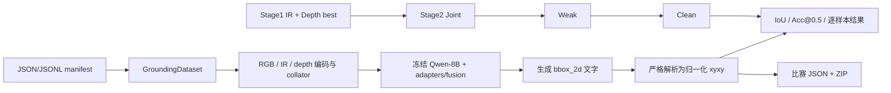

# 2026-09-11：TriGround 训练、评估与提交链路审计

## 范围、结论和证据边界

审计对象为 `F:/AIC/code` 的 `2571a4c8ba6b7d870971ac895d12b465627a2f2d`
（`main` 与 `origin/main` 同指向该提交）。先只读检查代码、配置、脚本、文档及本机可见的运行产物；审计后仅修复已确定的预检阻断并新增回归测试，见下方修复补记。没有改动算法、训练配置、数据或权重，也没有训练或下载模型。

最重要的结论有三项：

1. README 中的 `0.6404` 和 `0.6785` 是历史 **Qwen3-VL-2B** 路线的比赛数值，并不是新 8B 五阶段实验的结果（`README.md:3,15-22`）。本机没有五阶段的训练日志、`*.pt`、评分回执或可把 8B checkpoint 与成绩关联的结果文件。因此目前不能对 8B 的效果、可训练性或官方分数作任何正面结论。
2. 审计时，8B 正式 Slurm 链路会在每一阶段训练前调用 `tools/preflight.py`（`scripts/qwen3_vl_8b_formal.slurm:21-30`），而该脚本直接修改冻结的 `ModelConfig`，会在加载模型前抛出 `FrozenInstanceError`，故当时是 P0 阻断项。该问题现已最小修复为 `dataclasses.replace` 创建预检副本（`tools/preflight.py:3-7,103-111`），并由非 `--offline` 的 CPU 回归测试覆盖；真实 8B GPU 预检仍尚未执行。
3. 即使修复 P0，当前五阶段的有效目标域联合训练预算只有 58（Joint）+62（Weak）+58（Clean）=`178` 次优化器更新；联合融合器没有从两个单模态融合器 warm start。应先完成预检、重叠审计和一个固定初始化的 warm-start A/B，再讨论更大的结构改造。

本机不含 Stage1 的 RGBT/RoboRefIt 清单、目标域 `city_detection_prepared` 清单、8B `runs/` 产物或集群日志，因而下文的样本数来自版本内文档和 YAML，而不是重新统计原始数据。它们应在集群上以实际 manifest 和审计 JSON 再次验证。

### P0 修复补记（审计完成后）

根据本轮决定，`tools/preflight.py` 已将冻结对象上的原地赋值替换为：先把源配置的 dropout 写入 report，再以 `replace(config, model=replace(config.model, modality_dropout=0.0))` 构造仅用于预检的副本。这样 `train.py` 的源配置不被修改，report 仍同时保存训练值 `0.2` 与预检值 `0.0`。

新增 `tests/test_preflight.py` 运行真实 `preflight.main()` 的非 `--offline` 路径；数据集、processor 与模型边界均为 CPU mock，因此不会下载或加载权重。该测试断言：processor 收到本地缓存限制与 revision、模型收到 dropout 为 0 的新 `ModelConfig`、源配置仍为 0.2、stdout report 同时含两个 dropout 值。焦点命令 `pytest -q tests/test_preflight.py` 为 `1 passed`；与配置和 Slurm 编排的相关组 `pytest -q tests/test_preflight.py tests/test_config.py tests/test_slurm_scripts.py` 为 `15 passed`，另有 `ruff check tools/preflight.py tests/test_preflight.py` 与 `compileall` 通过。它不代替真实 8B CUDA forward/backward/显存预检。

## 现有成绩：必须分开解释

| 证据 | 可得结论 | 不能推出的结论 |
| --- | --- | --- |
| `README.md:3,15-22` | `0.6404`（弱监督早期融合）与 `0.6785`（独立 adaptor 后融合）是历史 2B 比赛结果。 | 不是 8B、DeepStack 或本次五阶段链的分数。 |
| `MODEL_REGISTRY.md:16,49-51` | 记录的 `combined284`：RDT 为 mIoU `0.5952` / Acc@0.5 `69.01%` / Acc@0.7 `54.93%`，Parallel 为 `0.5882` / `67.96%` / `55.28%`。 | 不是官方提交回执，也不能和 README 的比赛准确率横比。 |
| `MODEL_REGISTRY.md:53-59` 与 `README.md:178-179` | `combined284` 的 `new154` 与 RDT 原始弱监督训练数据重合，绝对分数不是干净泛化估计。 | 不能据此宣称任何模型在独立集领先。 |
| `QWEN3_VL_8B_UPGRADE.md:77-89`、`SLURM.md:123-125` | 8B 计划要求真实 L40 预检；当前只有脚本/CPU 验证的历史记录。 | 没有说明 8B 真实 forward、显存、梯度或正式评估已跑通。 |

119 条验证集的单个样本会改变 Acc@0.5 约 `100/119 = 0.8403` 个百分点。报告 119 条结果时必须同时给出命中数、逐样本 JSONL、parse rate（可解析率）和固定 checkpoint；不应只报两位小数的百分比。

## 五阶段配置、样本与优化预算

所有五份 YAML 都使用 `Qwen/Qwen3-VL-8B-Instruct`、`backbone_revision: main`、BF16，冻结视觉 LoRA，`adapter_channels=256`、fusion（融合）宽度 512、8 个 attention heads（注意力头）、mixer 宽度 2048、query encoder（查询编码器）宽度 128、4 个融合层 `[8,16,24,26]`（例如 `configs/qwen3_vl_8b_stage2_joint.yaml:3-24`）。`main` 不是固定 revision，运行时应记录下载到的实际 commit/hash；否则同一 YAML 的可复现性不足。

| 顺序 | 配置与数据 | 训练设置 | 可计算的更新数 | 初始化与可训练模块 |
| --- | --- | --- | ---: | --- |
| 1A IR | `qwen3_vl_8b_stage1a_ir.yaml:24-44`；外部 RGBT `train_50`、外部 val | 3 epoch，batch 1，累积 16，LR `3e-5`，`eval_subset_size=512` | 清单不在本机，无法计算 | `parallel_joint_fusion=false`；只训练 IR adaptor/query 等单模态参数。 |
| 1B Depth | `qwen3_vl_8b_stage1b_depth.yaml:24-46`；外部 RoboRefIt `train_50`、testA | 3 epoch，batch 1，累积 16，LR `3e-5`，subset 512 | 清单不在本机，无法计算 | 与 1A 对称，训练 Depth 分支。 |
| 2 Joint | `qwen3_vl_8b_stage2_joint.yaml:25-50` | reviewed manual train 923、val 119；1 epoch，batch 1，累积 16，LR `1e-5` | `ceil(923/16)=58` | 合并 1A/1B best；开启 joint fusion，冻结 adapters。 |
| 3 Weak | `qwen3_vl_8b_stage2_weak.yaml:25-49` | scene-safe weak 992；val 同为 119；1 epoch，batch 1，累积 16，LR `1e-5` | `ceil(992/16)=62` | 载入 Joint best；joint fusion 开启，adapters 冻结。 |
| 4 Clean | `qwen3_vl_8b_stage2_clean.yaml:25-49` | reviewed manual train 923、val 119；1 epoch，batch 1，累积 16，LR `3e-6` | `ceil(923/16)=58` | 载入 Weak best；joint fusion 开启，adapters 冻结。 |

文档把目标域人工复核源明确为 1,042 条：249 个 sequence（序列）中的 923 条训练、24 个序列中的 119 条验证，且两者不相交（`QWEN3_VL_8B_UPGRADE.md:39-45`）。Weak 规定为 992 个不同场景，并排除 284 条独立测试集对应的序列（`:47-52`）。这不自动证明它也与 119 条验证集无场景/图片重叠；正式前仍须执行五个训练源到 119 及独立集的实际 overlap audit（重叠审计）。`tools/prepare_slurm_run.py:76-93` 已将这一步接入正式流程，`SLURM.md:113-117` 也明确解释了检查范围与局限。

该配置中 `eval_subset_size=119` 恰等于记录的验证集大小，所以目标域三个阶段的 subset 与 full validation 相同。Stage1 的样本量、图像/类别/尺度分布和真实更新数不能在缺失清单时猜测；集群启动后应先把各 manifest 的样本数、sequence/scene、类别、bbox 尺度、深度位深/通道数写入 run report。

## 端到端链路审计

### 数据和训练

- `GroundingDataset` 从 JSON/JSONL 读记录，延迟到 `__getitem__` 时验证 bbox、query 和模态路径（`src/mm_grounding/data.py:35-52,81-115`）。深度图若是多通道数组只使用 channel 0，并按 `depth_scale=1000`、20 m 截断后对数编码（`:17-29`）。是否符合真实深度的单位、通道语义和插值特征，在无原图/清单时尚未验证。
- `train.py` 分别构造训练、分层 subset 验证和 full 验证 loader（`train.py:73-90`）；subset 按 `class_name` 与 `scale_bin` 分层（`:16-38`）。若 manifest 未带这两项，会退化为一个组，但 119 条配置不受 subset 截断影响。
- 每轮只按验证集上的 `Acc@0.5 → mIoU → Acc@0.7 → parse_rate` 字典序选 best（`src/mm_grounding/engine.py:18-34,526-557`），最终或早停时才对 full loader 评估（`:558-564`）。对大于 subset 的验证集，这意味着 full 指标只用于报告而不参与选模；对当前 119 条则两者相同。
- `TrainConfig.early_stopping_min_delta` 默认 `0.005` 且做了参数校验（`src/mm_grounding/config.py:58-70,184-191`），但 `selection_improved` 仅用严格字典序 `candidate > best`，没有使用该阈值（`src/mm_grounding/engine.py:28-34`）。这是通用的 P1 语义缺口；本五阶段每个目标域阶段仅 1 epoch，实际不改变其 checkpoint 选择。

### 初始化与迁移

Stage1 的 `parallel_joint_fusion=false`，而从 Joint 起为 true 且 `freeze_parallel_adapters=true`（Stage1 `qwen3_vl_8b_stage1a_ir.yaml:15-23`；Joint `qwen3_vl_8b_stage2_joint.yaml:15-24`）。Stage2 以 `strict=False` 合并 sparse checkpoint，并忽略 missing 项（`src/mm_grounding/checkpoint.py:90-113`）。之后前向选择的是新的 `joint_stage_fusions`（`src/mm_grounding/adapters.py:1053-1065`），而旧 `stage_fusions` 在联合阶段被冻结（`src/mm_grounding/model.py:460-470`）。

这不是加载失败：IR/Depth adaptor 与单模态 query encoder 能迁移且会被使用。但 Stage1 学到的旧融合器不会直接用于 Stage2 的新 joint fusion。已有 `warm_start_joint_from_legacy()` 会复制 IR/Depth 投影，并平均 RGB 投影与语言注意力（`src/mm_grounding/adapters.py:991-1012`），且 `train.py` 在加载稀疏 checkpoint 后调用它（`train.py:57-62`）；五份 8B YAML 均未开启 `warm_start_joint_fusion_from_legacy`，默认值是 false（`src/mm_grounding/config.py:89-90`）。因此应把此开关作为固定数据、固定 seed、固定步数的 A/B 假设测试，而不能预先声称它提升成绩。它也不会初始化 gate、restore、mixer、modality attention（模态注意力）等其余 joint 参数。

### 评估与提交

- 模型输出只接受包含四个 0–1000 坐标的 `bbox_2d` 字段；不符合格式、越界或非严格 xyxy 的输出会变成零框参与 IoU（`src/mm_grounding/engine.py:93-103,150-199`）。评估会输出 parse rate、生成达到 token 上限的比例和相应 parse failure rate；`evaluate.py` 可写逐样本证据并评估 RGB、RGB+IR、RGB+Depth、三模态路径（`evaluate.py:171-215`）。这已覆盖常见的格式失败，但尚无任何 8B 的实际解析统计。
- 提交脚本在真正 DataLoader 访问记录前写入内存 dummy bbox，因此不需要标签且不会覆写源 query（`tools/predict_competition_submission.py:128-153`）。它会保留 ID 顺序和输入字段、检查 bbox 合法性（`:59-70`），对不可解析输出写 fallback 并统计数目（`:167-215`）。该路径的主要剩余风险是模型真实 parse/fallback 比例和官方封包回执，而不是这段 dummy target 的顺序。
- `train.py` 和 `evaluate.py` 都将 `config.model.backbone_revision` 传给 `AutoProcessor.from_pretrained`（`train.py:50-55`、`evaluate.py:145-150`），但提交工具没有传入 revision（`tools/predict_competition_submission.py:119-123`）。当前 YAML 使用动态的 `main`，所以尚未构成一次可观测的模型不匹配；一旦把训练固定到 commit，提交脚本会悄悄回到模型仓库当时的默认版本，破坏可复现性。

### 人工复核来源

历史 `prepare_target_v2_data.py` 会把没有 review decision 的记录默认为 `valid`，并把 destination 缺失/hold/train_supplement 都放入训练（`tools/prepare_target_v2_data.py:76-120`）。另一份 `apply_candidate_reviews.py` 提供 `--require-complete`，但这是可选项（`:17-55,74-89`）。这是一项数据构造的历史风险：应追溯最终 923/119 manifest 的 review report，而不是据此断言当前正式清单已经泄漏或标签错误。

## 问题分级与最小修复/验证顺序

| 优先级 | 发现 | 证据与影响 | 最小动作 |
| --- | --- | --- |
| 已修复（发现时 P0） | 预检对冻结 dataclass 赋值 | 审计时 `ModelConfig` 被 `@dataclass(frozen=True)` 定义（`config.py:9`），而旧 `preflight.py:106` 直接赋值。CPU 最小复现得到 `dataclasses.FrozenInstanceError: cannot assign to field 'modality_dropout'`；正式脚本会在训练前停止（`scripts/qwen3_vl_8b_formal.slurm:12,25-30`）。 | 现已用 `dataclasses.replace` 创建仅供预检的 config/model 副本，且 `tests/test_preflight.py` 穿过真实非离线 `main()` 路径验证 report 与源配置。仍须在真实 8B GPU 上跑两步预检。 |
| P1 | 联合融合器没有 warm start | 如“初始化与迁移”所述，178 次目标域更新中 joint fusion 主要从随机初始状态学习。 | P0 后只新增一份训练配置，开启该现成 flag；用同一 Stage1 权重、相同 seed/数据/178 更新，完整 119 条逐样本评估和 parse/fallback 对比。保留更好的 checkpoint 的证据，而非覆盖 baseline。 |
| P1 | 119 与 weak 的实际重叠尚无运行证据 | 文档只明确 weak 排除 284 测试序列（`QWEN3_VL_8B_UPGRADE.md:47-52`）；脚本也要求实际审计（`SLURM.md:113-117`）。 | 在任何 preflight/训练之前运行 `prepare_slurm_run.py`，保留 `audit_reviewed_val.json` 和独立集 audit；若任一 ID/图像/scene 重合，先人工核对来源，禁止把该分数称作验证/独立测试。 |
| P1 | 没有 8B 成绩和提交证据 | 本机无 run、checkpoint、正式评估 JSONL、submission ZIP 或评分回执。 | P0 修复后的 smoke → 正式链；每阶段保存配置、preflight JSON/日志、best/last/mIoU-best 元数据；最终在 119 和明确的 284 标签保留集分别给出四模式、逐样本、命中数。 |
| P2 | `early_stopping_min_delta` 未实施 | 参数存在且校验，却未用于改善判断。对本五阶段 1 epoch 的后三阶段无实际影响。 | 在需要多 epoch 的后续实验再修正并为阈值写行为测试；不要为当前 1 epoch 链优先改它。 |
| P2 | 提交不继承模型 revision | `train.py:50-55`、`evaluate.py:145-150` 会传 revision，提交的 `AutoProcessor.from_pretrained` 不会（`predict_competition_submission.py:119-123`）。 | 固定 8B revision 后，让提交加载与训练/评估相同的 revision；用一个不联网的 mock 测试断言参数被透传。 |
| P2 | 深度通道/单位和复核缺项是未验证的数据风险 | channel 0/1000 mm 假设见 `data.py:17-29`；历史 review 默认规则见上文。 | 在集群执行小型只读 manifest/profile report：位深、通道、有效深度、尺寸、类别/bbox 规模、review decision/destination 覆盖率；不重建数据、不引入新标签。 |

建议的实验执行顺序是：

1. 修复 P0，运行对应单元测试，然后用真实 8B 缓存和最大视觉 token 的 IR、Depth、Joint 预检；确认第二步后 joint/query 有非零有限梯度且冻结模块没有梯度。
2. 先产出五来源与 119、284 的重叠报告及真实数据 profile；只有报告通过才启动训练。
3. 运行现有基线五阶段链，保存完整日志、119 条四模式和逐样本评估。119 条只作验证，284 条才可作为独立保留评估。
4. 在相同起点做 `warm_start_joint_fusion_from_legacy=false/true` 的最小 A/B；主指标为 Acc@0.5 命中数，同时报告 mIoU、Acc@0.7、parse rate、paired row 差异和模态增益。
5. 仅当 A/B 证明现有迁移/数据路径确实稳定后，再执行已有 query position（查询位置编码）A/B。Direct BBox Head（直接边界框头）等结构改造应排在真实基线与误差分层之后。

## 本次核查记录

- CPU 最小复现了 P0 的冻结赋值异常，随后已以 `dataclasses.replace` 修复；新增的非离线 main 路径 mock 回归测试通过。未尝试加载 8B 主干或执行训练。
- 已检查 `train.py`、`evaluate.py`、`config.py`、`checkpoint.py`、`data.py`、`engine.py`、metrics/boxes、相关数据准备/复核/提交工具、五份 8B YAML、Slurm 编排和项目文档。
- 本次审计后按明确授权仅改动 `tools/preflight.py` 和新增 `tests/test_preflight.py`，未改算法、配置、数据或权重；本报告同步记录该修复。
