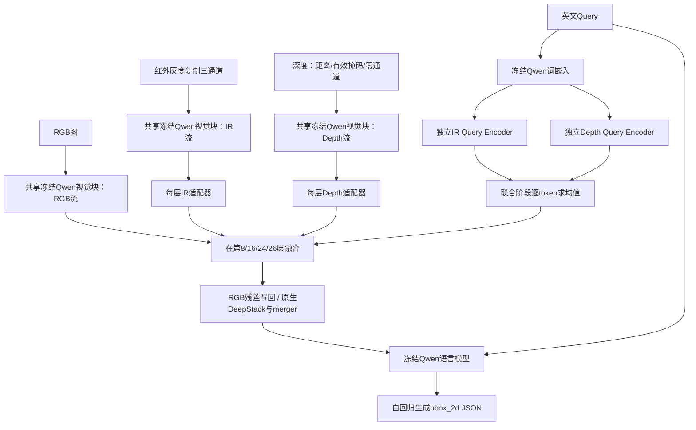

# TriGround 当前架构、低分诊断与改进路线

日期：2026-09-11。审计基准：`F:/AIC/code`，`main@2571a4c8ba6b7d870971ac895d12b465627a2f2d`。本轮已执行远端更新和 `git pull --ff-only origin main`，返回 Already up to date。用户确认：没有更新的提交，就分析当前版本。

## 1. 先给判断

**我建议把下一阶段的主任务从“继续增加融合结构”改为“建立可比较的强基线，确认三模态究竟补对了哪些样本，再集中训练这些能力”。** 当前实现已有每层辅助适配器、四层联合融合、查询条件注意力、两级可靠性门和五阶段训练，结构复杂度已经足够开展严肃实验；最缺的是当前 8B 的运行证据、干净且足够覆盖任务难点的验证、以及与简单强基线的公平比较。

代码给出了三个尤其值得验证的架构假设：辅助 Query 编码没有词序；Stage 1 学到的融合器到 Stage 2 被新的 Joint 融合器替换；约 4506 万个目标域可训练参数只安排了 178 次优化器更新，还受到保守门控和零初始化的约束。这些都可能影响样本效率，但**目前不能把其中任何一项写成历史低分的已证实根因**。

另一条值得同时建立的路线是：用强定位模型产生高召回候选框，再用 Query、局部 RGB/IR、有效深度统计决定目标。它能把“没有找到目标”和“找到很多目标但选错了”拆开，让调参有明确对象；是否值得投入，先由候选真值覆盖率决定。

本报告中的结论分为三类：

- **已确认事实**：来自本地官方材料、当前源码、版本内记录或 CPU 复现。
- **待验证假设**：有机制依据，尚无本项目 8B 对照结果。
- **外部证据**：论文或官方开源实现中的结果与设计，不能直接当作本赛成绩预测。

专项附录：[模型架构审计](./2026-09-11-architecture-audit.md)、[训练评估管线审计](./2026-09-11-pipeline-audit.md)、[多模态相关研究](./2026-09-11-multimodal-literature.md)。

## 2. 成绩和规则：先排除错误归因

### 2.1 当前究竟有哪些结果

| 记录 | 能说明什么 | 不能说明什么 |
| --- | --- | --- |
| README：RDT `0.6404`、Parallel `0.6785` | 历史 **Qwen3-VL-2B** 两条完整路线的比赛记录，后者高 3.81 个百分点 | 不是新 8B、四层 DeepStack 融合或本轮代码的成绩；也不隔离 IR/Depth 的因果贡献 |
| 注册表：combined284 的离线指标 | 可作为历史诊断资料 | 其中部分样本与旧弱监督训练重叠，不能作独立泛化结论 |
| 新 8B 五阶段 YAML、升级文档和 Slurm | 新架构与执行流程已实现 | 本机没有对应训练日志、checkpoint、逐样本结果或官方回执，不能说已经跑通或已经提分 |
| 历史 99 项 CPU 测试通过 | 覆盖当时的配置、模型替身、权重链和脚本编排 | 不代表真实 8B 预检、GPU 显存、梯度或生成质量通过 |

版本内证据见 [README](../../code/README.md)、[模型注册表](../../code/MODEL_REGISTRY.md)、[8B 升级说明](../../code/QWEN3_VL_8B_UPGRADE.md)。本轮没有得到更新的 8B 分数。因此下文回答的是“当前实现最值得如何改进”，不是对未知新分数作事后归因。

### 2.2 比赛约束对方案选择的影响

以本地 [官方赛题 PDF](../../contest/基于大模型的多模态视觉理解与推理.pdf) 第 4、7 页等材料为准：输入是对齐的 RGB、红外、深度和英文 Query；输出是 RGB 坐标系中的归一化 xyxy；IoU ≥ 0.5 算正确，最终关注 ACC@0.5。规则允许适配、轻量微调和检测器结合大模型，并不要求冻结全部 Qwen 参数，也不要求直接生成坐标。

因此，候选生成加选择、语言侧 LoRA、几何回归头、传感器专属编码器都是可讨论的技术选项。外部训练数据须注明来源；官方测试仅用于推理，不能做标注、训练或上传分析。涉及误差人工复核、难例构建、训练和反事实样本的建议，均针对合法训练/验证数据。不能直接照搬含商业闭源在线 API 的论文数据生成流程。

## 3. 当前架构与五阶段训练的准确拆解

### 3.1 一次前向到底发生什么

这里的三条流共享同一份视觉权重，却分别计算视觉激活。不能把它理解为三份独立 8B，也不能把参数冻结理解成三流计算和反向激活没有成本。当前主链没有 GroundingDINO、显式候选框或候选重排序。

官方 8B 配置为 27 层视觉块、宽度 1152、patch 16、空间合并 2；语言侧宽度 4096。融合层 `[8,16,24,26]` 中前三个位于原生 DeepStack 特征提取前，最后一个位于最终 merger 前。Qwen 的多层视觉特征注入机制被保留，不能继续把当前 8B 描述为旧 2B 的“只在最后一层融合”。[Qwen3-VL 技术报告](https://arxiv.org/abs/2511.21631)、[官方模型配置](https://huggingface.co/Qwen/Qwen3-VL-8B-Instruct/blob/main/config.json)

最大 `802816` 像素约对应每流 3136 个视觉 patch token，压缩后 RGB 向语言模型提供 784 个视觉 token。IR/Depth 主要通过写入 RGB 特征起作用，并不是各自再向语言模型增加一整套图像 token。

关键源码：`src/mm_grounding/model.py:136–229`、`:393–405`、`:540–577`；`adapters.py:601–865`。具体行号均基于审计提交，详见架构附录。

### 3.2 数据编码和监督

RGB 使用 RGB 图像；IR 转灰度再复制三通道。深度先按毫米换算，仅保留 `0 < d <= 20 m` 的有效值，做对数压缩；超范围值置为无效而不是夹到 20 m。之后组成 `[距离, 有效掩码, 0]` 三通道，再经过同一个 Qwen 图像处理器和冻结 RGB patch embedding。

训练标签由归一化坐标乘 1000、取整，生成 `{"bbox_2d": [x1,y1,x2,y2]}`；推理再除以 1000。这与 Qwen3-VL 归一化 2D 坐标协议相符，不能把 0–1000 输出本身当作坐标系错误。

8B 的实际优化目标仍是生成 token 的交叉熵。工程虽然有 Smooth L1/GIoU 的辅助框头，但配置明确禁止在 `parallel_backbone` 路线上使用；它不是 8B 现成可打开的一个 YAML 开关。`coordinate_token_loss` 目前只记录，不作为独立加权项进入总损失。直接把不可微的 argmax 坐标拿去计算 IoU，也不能自动得到有效的生成训练梯度。

### 3.3 五阶段的迁移关系与训练预算

| 阶段 | 数据来源 | 初始化与实际训练部分 | 预算 |
| --- | --- | --- | --- |
| 1A：IR | 外部 RGBT `train_50` | 训练 IR 每层 adapter、IR Query Encoder、旧式 IR 融合器；Qwen 冻结 | 3 epoch，LR `3e-5` |
| 1B：Depth | 外部 RoboRefIt `train_50` | 对称地训练 Depth 支路 | 3 epoch，LR `3e-5` |
| 2：Joint | 文档记录 923 条复核训练、119 条验证 | 载入两支 Stage1；训练新的 Joint 融合器及两个 Query Encoder；冻结视觉 adapters | 1 epoch，LR `1e-5`，约 58 次更新 |
| 3：Weak | 文档记录 992 条场景安全弱监督 | 延续 Joint | 1 epoch，LR `1e-5`，约 62 次更新 |
| 4：Clean | 回到 923 条复核训练 | 延续 Weak | 1 epoch，LR `3e-6`，约 58 次更新 |

目标域阶段 batch 1、梯度累积 16，故总计 `ceil(923/16)+ceil(992/16)+ceil(923/16)=178` 次优化器更新。Stage1 清单不在本机，不能推算其真实更新数。Phase A 没有学习率 warmup（预热），所以“预热耗尽 58 步”不是本实现的问题。

依据真实 8B 维度单独实例化融合模块，Stage2 可训练参数约 **4506 万**：四层 Joint 融合器约 4360 万，加两个 Query Encoder 约 146 万。大部分新 Joint 参数需要在目标域短训练中建立作用。参数多、步数少本身不能证明欠拟合，却非常值得先检查收敛和小样本过拟合能力。

冻结 adapters **不包括冻结 Query Encoder**；后者在 Joint 阶段仍会更新。Stage1 的旧融合器会被载入，但 Joint 前向选择新的模块，旧融合器被冻结且不执行。已有 warm-start（继承初始化）功能只复制/平均部分投影和语言注意力，8B 默认未启用；它不复制完整 Joint 结构，也不直接恢复旧残差输出。

## 4. 哪些问题已确认，哪些只是可能影响成绩

### 4.1 确定的运行阻断：预检修改只读配置

审计发现 `tools/preflight.py` 对 `@dataclass(frozen=True)` 的 `ModelConfig.modality_dropout` 直接赋值，CPU 复现得到 `FrozenInstanceError`。真实预检会在模型加载前停止，而冒烟和正式 Slurm 都依赖该入口。

这处代码由上轮补充预检时引入，本轮做最小修复：用 `dataclasses.replace` 创建仅供预检使用的配置副本，使预检关闭模态随机丢弃，同时保留源训练配置和报告中的原 dropout。入口回归测试的覆盖与最终结果见管线附录及交接文档。修复这一错误不等于完成 GPU 验证，也不解释此前的 2B 成绩。

### 4.2 已复现的辅助 Query 词序缺失

两路 Query 使用冻结 Qwen 的**预训练词嵌入**，并非随机词向量；但它们绕过 Qwen 文本 Transformer，由各自小型随机初始化编码器处理，默认没有位置编码。

无位置编码时，自注意力对 token 置换等变，随后视觉读取 Key/Value 对排列不敏感。CPU 测试中，词序置换后编码器重排误差约 `3.58e-7`，完整 Joint 输出差异为 0。辅助融合无法可靠区分“同样词集合、不同关系方向”的语句。

**适用边界**：完整 Qwen 仍读取有顺序的原 Query，整个模型没有变成词袋模型。已有正弦位置编码实现值得做严格对照，不能预先承诺它解决空间推理或带来若干个百分点。

### 4.3 待验证：新 Joint 的学习是否足够

Stage1 的 adapters 和 Query Encoder 会迁移，但已训练的旧融合器被替换。新 Joint 的 restore 零初始化，token 可靠性门和样本可靠性门偏置都是 -2，初始门乘积约 `sigmoid(-2)^2≈0.0142`。最后残差以 RGB 的 BF16 类型写回。

这里至少有两个可能：保守初始化成功保护 RGB，联合阶段随后学出有益变化；或者短训练后残差仍然很小、部分变化在 BF16 写回中消失。静态代码不能决定哪一个成立。

应测四层门控分位数、`RMS(delta)/RMS(RGB)`、写回后发生变化的 token 比例、前两步梯度，以及验证中的 RGB→三模态净增益。若已有明显有效残差，再讨论门偏置；若连小训练集都无法拟合，先解决学习路径和预算。不要同时把门、学习率、训练轮数和结构全部改掉。

### 4.4 待验证：两个独立 Query 表示直接相加是否合适

IR 和 Depth Query Encoder 在不同单模态数据上训练，Joint 却逐 token 求平均，再送同一个语言注意力。这要求两套 latent（隐表示）有足够一致的语义坐标系，工程中没有共享编码器或显式对齐损失保证这一点。

Joint 可共同更新两个编码器，因此这不是必然错误。最小对照是保留两路 token，拼接后加模态身份，再做一次共同注意力；另一个对照是共享一个 Query Encoder。只有在 Query 干预确实影响定位时，才值得为此投入更多参数和训练。

### 4.5 数据和验证，比增加模块更有可能决定上限

923 条复核目标域训练覆盖 249 个序列、119 条验证来自 24 个序列，均为版本文档记录。本机缺原始训练清单，尚未核对 actual manifest（实际样本清单）。Weak 文档明确排除 284 保留集对应序列，不能自动推出它与 119 验证集也无重叠。已有重叠工具要真实执行并保留报告。

119 条里一个样本就是 **0.8403 个百分点**。同场景多条 Query 相关，反复在同一小验证集选择十几种结构容易得到偶然赢家。应报告命中数和成对得失，按场景做 bootstrap（重采样）；扩大独立、任务相近的验证覆盖后，再解释小幅收益。284 只有实际确认与全部祖先训练集独立后，才能称为保留集，不能与历史有重叠的 combined284 混同。

此外，9 月 8 日本地只读格式审计发现，官方输入深度中 97/2000 组是 RGB/JPEG、其余 1903 组是 16 位图像；前者涉及 177/9555 条 Query（约 1.85%）。现代码取第一通道再按毫米解释；那些 JPEG 的真实编码尚不明确。该事实值得核查，但影响占比有限，不能用它解释所有低分。首先在合法训练/验证来源确认深度单位、有效值与空间配准；不臆造未知伪彩深度的反变换。

### 4.6 已改正的问题不要再次当成改进建议

当前已经按 `ACC@0.5 → mIoU → ACC@0.7 → parse_rate` 选模，已经重载 best 后评估，已有真正作用于 Joint 的尺度干预、四种模态评估、Query 因果诊断和逐样本成对比较。它们需要运行结果，而不是重复重写。

仍有次级缺口：`early_stopping_min_delta` 声明但未参与选模；提交的 processor 没有透传 backbone revision；正式流程最后固定评估 Clean best，未跨 Joint/Weak/Clean 统一选优。前两项分别影响后续多轮实验语义和固定模型版本后的复现，均不应抢占当前成绩诊断的主要资源。

## 5. 论文与高星仓库：哪些内容值得真正搬过来

检索截至 2026-09-11，覆盖通用视觉定位、复杂指代表达、RGB-T/RGB-D 融合、几何监督和感知强化学习。优先一手论文、官方仓库与实际源码；“广泛检索”不等于保证穷尽全部研究。下面区分已读取源码的方案与只作为论文启发的方向。

### 5.1 强定位基线：GroundingDINO、Rex-Omni、LocateAnything

| 方案 | 有证据的能力或设计 | 对本项目的用途 | 需要保留的限制 |
| --- | --- | --- | --- |
| [GroundingDINO](https://arxiv.org/abs/2303.05499) | 文本条件开放词表检测，官方实现提供多候选和文本匹配分数 | 低成本候选基线；拆分名词类别检出与复杂 Query 选择 | 原始分数是 caption token 匹配置信度，不是关系推理正确率；弱光 RGB 可能漏检 |
| [Rex-Omni](https://arxiv.org/abs/2510.12798) | 3B 定位专用模型；大规模监督后强化学习，使用专门坐标 token | 直接 grounding（指代表达定位）对照；候选生成；合法训练数据的标注辅助 | 原论文训练规模远超当前项目；坐标协议/解析器与 Qwen 不能混用；不证明三模态目标域一定更强 |
| [LocateAnything](https://arxiv.org/abs/2605.27365) | 3B 定位模型；并行框 token 解码与混合解码路径 | 截至检索日值得纳入的较新专用模型基线，检验框精度和候选质量 | 专用架构、token 和生成逻辑，不能直接拷成当前冻结 8B 的一个输出头 |
| [Qwen3-VL](https://arxiv.org/abs/2511.21631) | 多层视觉注入、空间能力和 0–1000 坐标协议；官方支持独立控制视觉/语言微调 | 原生 RGB 8B 和 RGB 定位 LoRA 必须成为对照，判断三模态工程的机会成本 | 通用大模型能力与小规模目标域训练的提升不能混为一谈 |

不能按参数量认定 8B 必然赢 3B。也不能按新论文认定 LocateAnything 全面强于 Rex/Qwen：其论文 Table 5 的不同数据集和 IoU 阈值排序不同，高 IoU 下的框精度收益与本赛 IoU=0.5 的准确率并不等价。

**源码拆解得到的具体工程结论：**

1. GroundingDINO 的 `predict()` 使用每个候选在文本 token 上的最大分数做阈值过滤，输出归一化 cxcywh；接入本项目时必须明确转成 xyxy。不要把它对长句最高分的框当成已完成“第二个、最近、左后方”的推理。[固定版本源码](https://github.com/IDEA-Research/GroundingDINO/blob/856dde20aee659246248e20734ef9ba5214f5e44/groundingdino/util/inference.py)
2. Rex-Omni 的 grounding 数据任务、监督训练和 reward function（奖励函数）是独立模块，适合学习定位专门化训练如何组织。官方自动数据引擎还利用名词短语提取，不能因此认定其自动保证复杂关系标签正确。[任务构造](https://github.com/IDEA-Research/Rex-Omni/blob/6508981c1e0c3fbb2dbe7b962a4bb745005f3e2e/finetuning/dataset/task_fns/grounding_task.py)、[奖励实现](https://github.com/IDEA-Research/Rex-Omni/blob/6508981c1e0c3fbb2dbe7b962a4bb745005f3e2e/finetuning/verl/configs/reward_func.py)
3. LocateAnything 的生成工具识别不同 token 模式，框采用专门的 6-token 结构，必要时走混合自回归路径。其并行预测依赖模型训练与协议共同设计，不能仅依据“多 token 预测”术语重写当前解码器。[生成源码](https://github.com/NVlabs/Eagle/blob/783f656d127ee498137b5ff52603ce36c292d317/Embodied/eaglevl/utils/locany/generate_utils.py)
4. Qwen 官方微调脚本能分别控制视觉、视觉连接层和语言模型，LoRA 常作用于 q/k/v/o 投影。先做独立 RGB 微调对照最清楚；要接入 TriGround 还需处理其自定义冻结策略和稀疏 checkpoint，不能声称设置已有 Vision LoRA 开关就能完成语言侧微调。[官方训练入口](https://github.com/QwenLM/Qwen3-VL/blob/96588727e44c78b25ba03ea03b8e12f7e64fd0da/qwen-vl-finetune/qwenvl/train/train_qwen.py)

实际运行外部模型前按其官方模型卡核对权重、依赖和研究使用条件。这里推荐本地开放权重路径，不推荐 GroundingDINO 品牌下的商业在线服务。

### 5.2 复杂指代：候选选择比让模型反复生成四个数字更可诊断

[FineCops-Ref](https://arxiv.org/abs/2502.20104) 直接研究复杂属性、关系及难负例，提出按难度分配专用模型/多模态大模型，以及 Candidate Region Selection（候选区域选择）。其价值与本任务高度一致：先保留若干可能框，再把答案空间变成候选编号。

我们读取的官方 CRS 代码保留 top-10 候选，通过全局图像、坐标选项让模型选 A–J；它并不等于“已经实现三模态局部裁剪”。本报告提出的三模态裁剪和深度特征是对该思想的本地扩展。源码也有候选字段约定不一致，接入应定义自己的最小统一数据格式；SFA 中的在线商业模型调用不能照搬。[候选生成](https://github.com/sleepyshep/FineCops-Ref/blob/8ecf8a9c19c0fecac81190a88df10b4f6744b782/CRS/candidate_generation.py)、[候选选择](https://github.com/sleepyshep/FineCops-Ref/blob/8ecf8a9c19c0fecac81190a88df10b4f6744b782/CRS/region_selection_pos.py)

[Ref-Adv](https://arxiv.org/abs/2602.23898) 与 [GroundingME](https://arxiv.org/abs/2512.17495) 则提醒：普通 RefCOCO 得分不能充分代表多干扰物、否定、关系限制和拒绝能力。它们更适合指导本地验证集的难例分类，不能把外部测试样本拿来训练后宣称泛化提升。官方 Ref-Adv 的报告代码也按干扰物和 IoU 阈值细分，这种评估习惯值得借鉴。[Ref-Adv 仓库](https://github.com/dddraxxx/Ref-Adv)

### 5.3 RGB-T / RGB-D：借鉴机制前先考虑任务迁移

直接相关的 RGBT referring grounding、RoboRefIt，以及 CMX/CMNeXt 等 RGB-X 融合工作，详见[多模态研究附录](./2026-09-11-multimodal-literature.md)。其共同启发是：传感器质量、对齐、模态互补以及任务语言条件应被显式验证，不能默认三流特征相加就利用了距离或热信息。

对当前系统，优先级更高的迁移方式是：先验证深度有效区域和目标级距离统计；如果编码域差异已经成为瓶颈，再加轻量深度输入映射；如果辅助流经常伤害 RGB，再做质量控制和保守路由。语义分割中的融合模块并未在“英文 Query 指向唯一目标、生成 bbox”的同等条件下验证，不能因为分割论文涨点就整体搬入 Qwen。

### 5.4 强化学习、更多推理、分割精修：值得知道，暂时不要列第一优先级

- [Visual-RFT](https://arxiv.org/abs/2503.01785) 展示了用可验证视觉奖励训练模型；[Perception-R1](https://arxiv.org/abs/2504.07954) 研究感知任务的强化学习与推理形式。它们支持“几何奖励值得研究”，不支持“加 GRPO 就必然提升本赛”。当前应先具备稳定监督基线、正确标签和有效采样。
- Rex-Omni 自己的消融也指出，强化学习收益有相当部分来自减少重复和异常大框，而匹配后的框精度收益有限。它是反对盲目追逐强化学习的有用证据。
- [CuRPO](https://arxiv.org/abs/2511.13924) 和感知强化学习研究提示，长 CoT（思维链）并不稳定改善定位。先试短的对象属性/关系判别或候选编号选择，别默认延长生成就是增强推理。
- [VGent](https://arxiv.org/abs/2512.11099) 的模块化理解与预测，以及 [Perceive-to-Reason](https://arxiv.org/abs/2607.01191) 的局部感知和推理协同，可启发全图加局部裁剪；但它们的任务、训练成本与当前单框比赛不同，不是已验证可直接替换的方案。
- [SAM 2](https://github.com/facebookresearch/sam2) 可在目标已经正确时辅助精修轮廓/框；初始选错对象时，分割再精细也无法恢复正确指代。只有“对象对、框边界差”占比足够高时才值得安排。

### 5.5 高星仓库的核验范围

下表星数为本轮 GitHub API 读取快照（2026-09-11），会变化；它代表生态活跃度参考，不代表比赛效果。小星数但任务直接相关的论文实现也予以保留。

| 官方仓库 | 星数快照 | 本轮读到的核心实现 | 审计版本 |
| --- | ---: | --- | --- |
| QwenLM/Qwen3-VL | 19,929 | 微调入口、参数冻结、LoRA 目标、2D grounding 示例 | `96588727e44c` |
| IDEA-Research/GroundingDINO | 10,565 | 推理分数、候选框格式、模型前向与查询配置 | `856dde20aee6` |
| NVlabs/Eagle | 3,541 | LocateAnything 模型、并行/混合生成、推理与训练入口 | `783f656d127e` |
| IDEA-Research/Rex-Omni | 1,578 | wrapper、grounding 任务、SFT/GRPO 配置与奖励、数据引擎 | `6508981c1e0c` |
| dddraxxx/Ref-Adv | 28 | 仓库文档与在线评估报告实现 | `06e5b15dafa0` |
| sleepyshep/FineCops-Ref | 9 | 候选生成、候选选择、目标提取 | `8ecf8a9c19c0` |

只下载了公开代码和元数据作阅读缓存，位置为 `docs/research/source-audits/2026-09-11/`；没有执行这些外部代码、安装其训练环境或下载模型权重。RGB-X 专项的额外仓库及证据见研究附录。

## 6. 我建议的改进优先级

### 第一优先级：把强基线和错误分解做出来

在完全相同的验证清单、图像预算、提示及解析规则下至少比较：

1. 原生 Qwen3-VL-8B RGB。
2. 当前 TriGround 的 RGB-only、RGB+IR、RGB+Depth、Triple 四模式。
3. 历史可用的 2B 最好模型（只有能取到确切权重与配置时才加入）。
4. 一个专用定位模型：先按环境可用性选择 GroundingDINO、Rex-Omni 或 LocateAnything，不必一开始全部训练。

四模式必须从同一个多模态 checkpoint 评估；RGB 原生模型与 RGB 微调模型是另两种独立对照。记录每个样本中 RGB→Triple 的“错变对”和“对变错”，而不是只看总分差。

把失败至少拆为：解析/非法框；目标根本没检出；同类目标选错；属性/关系理解错；目标正确但尺度/边界差；辅助模态把原本正确的 RGB 带错。小目标、弱光、遮挡、序数、前后/远近、左右、颜色类别单独统计。分类由训练/验证数据完成。

若 RGB 和 Triple 很接近且模态替换不影响输出，先查融合是否有效；若三模态修复弱光同时损伤正常 RGB，先做质量控制；若主要是对象已对但框差，优先坐标监督或候选框精修；若都是同类对象选错，优先候选选择与关系数据。

### 第二优先级：让现有融合在可控数据上学会，再做最小消融

先用 16 或 32 条合法训练样本做过拟合试验：记录生成命中数、交叉熵、有效残差与梯度；不要求凭空指定固定 100% 门槛，但应看到可重复的明显拟合改善。如果训练损失下降而真实生成始终不改善，检查 teacher forcing（给定真实前文训练）与生成差异、可训练通路、解析及标签。

然后固定同一 Stage1 权重，按顺序测试：

- **训练预算**：先看更长 Joint 是否仍带来验证改善；按更新次数对齐比较，不以“都跑一轮”替代预算控制。Clean 是否必须经过 Weak，也做一次分支对照。
- **Query 位置**：现成 `none/sinusoidal` 开关，改动小，机制直接；需要相同起点和数据顺序，且检查关系子集。
- **Joint warm-start**：使用已有实现复用 Stage1 部分投影；不要把它和增加训练轮数捆在同一比较中。
- **门控**：仅在实测残差偏小的条件下比较当前偏置与较开放偏置。先留住 RGB 能力，不能靠无条件放大辅助噪声换训练集收益。
- **两路 Query 的平均方式**：在前面已有稳定基线后，比较 mean 与保留模态身份的拼接，必要时共享编码器。

每个实验都保留 baseline（基线）权重。首轮用同 seed 筛选，候选提升只有一两例时再用另一 seed 和场景重采样检验稳定性，不要把 119 条上的一次胜负写成定论。

### 第三优先级：建立候选生成 + 三模态选择支线

候选路线首先回答一个可测的问题：**正确框有没有在候选里？**

定义：`OracleRecall@K = mean[ max_j IoU(candidate_j, GT) >= 0.5 ]`。对于只能从候选中选框的系统，最终 ACC@0.5 不可能超过该指标。应同时报告 K=1/5/10，以及小目标、弱光和多同类子集的覆盖率。

最小实现可分两步：

1. 用类别/对象名提示和完整 Query 两种方式生成候选，按位置与重叠去重，保留来源和原始分数；不要把不同对象的框直接平均。
2. 对 K 个候选提供全局上下文、局部 RGB/IR 裁剪、框坐标、有效深度比例和稳健距离统计。模型输出候选编号，输出层从候选表读取原始框。

空间关系中可明确计算的部分尽量直接算：左右/上下面积位置、序数排序、框间距离、有效深度中位数。语言模型负责将 Query 映射到关系与比较对象，不能用全图中位数冒充目标距离，也不能把所有“front/behind”都简单等同于相机深度顺序。

RGB 候选召回不足时，单纯重排序无解。下一步可能是提高图像预算、候选模型联合、分块/局部二次搜索，或有监督的 IR 检测支路；不能假定把 IR 直接喂给 RGB 检测器就有高召回。候选选择内部可以识别“都不合适”，但官方唯一目标任务最终仍需自动返回合法框；这类候选失败必须在离线评估中计错。

**进入后续训练的条件**：候选 OracleRecall 比当前直接定位有足够余量，且实际选择准确率与 Oracle 明显有差距。若候选上限已经低于现有模型，就先补召回或暂停该路线。

### 第四优先级：围绕真实错例建设目标域关系数据

外部 RGBT/RoboRefIt 的价值是传感器与定位预训练，并不保证覆盖本赛场景、对象尺度和英文关系表达。下一批数据应由验证错误分布决定：同类多实例、遮挡、弱光、最近/最远、左右/前后、序数和相似属性。

优先保留一个图中多个对象及关系背景，加入目标与干扰物成对例子；同图不同 Query 选择不同对象特别有价值。伪标签应检查框是否对应 Query、是否多目标歧义、是否把大框或高置信度误当正确。置信阈值不是关系标签质量的证明。

增强要尊重语言：水平翻转时同步修改 left/right 等 Query 语义；颜色是指代条件时不能任意改色；局部裁剪可能丢失关系对象，不能照搬分类增强。

Weak 是否提高最终成绩必须由 `Joint→Clean` 与 `Joint→Weak→Clean` 对照决定。正式选择可比较各阶段保留的 checkpoint，不应默认最后阶段一定最好。把 Weak 数据量加大之前，先看它修复和新增了哪些错误。

### 第五优先级：根据诊断选择适配深度、语言侧微调或几何监督

| 观察到的证据 | 优先尝试 | 暂缓的改动 |
| --- | --- | --- |
| 深度输入有效，但冻结 RGB stem 后难利用，RGB+Depth 稳定无收益 | 轻量深度输入 stem（前置映射），或目标级深度几何特征 | 一上来替换完整视觉主干 |
| 原生 RGB 强、当前融合经常破坏它 | 可靠性校准、质量条件路由、较少融合层的受控对照 | 无条件开门/加大残差 |
| 正确对象候选很多，关系选择弱 | 候选编号监督、难负例和关系表达数据；独立 RGB 指令 LoRA 对照 | 优先换更大骨干或长 CoT |
| 对象正确但大量 IoU 卡在 0.5 附近 | 坐标 token 加权监督，独立可训练框头对照，局部框精修 | 未验证标签/解析前直接 GRPO |
| 当前小数据训练仍欠拟合 | 增加有效训练更新、合理学习率和迁移初始化 | 继续增宽 Joint 参数 |

语言侧 LoRA 是有意义的控制实验，因为完全冻结 Qwen 是当前团队设计选择而非比赛规定。直接框头则需要在 parallel 架构上明确读取位置，避免训练时读取答案 token；推理输出和选模协议也应一起设计。两者都不应先与所有融合修改混在一个“大升级”中。

## 7. 可直接执行的实验登记表

实际墙钟时间取决于 L40 可用性、数据加载和真实 token 数；这里给相对成本，不编造 GPU 小时或预期涨点。按依赖推进，可复用的候选和逐样本输出缓存优先复用。

| 编号 | 要回答的问题 | 唯一主要变化/执行内容 | 关键产物与继续条件 | 相对成本 |
| --- | --- | --- | --- | --- |
| E0 | 8B 真实可运行且有有效学习路径吗 | 修复后 IR/Depth/Joint 预检；最大预算；两步优化；16/32 条训练拟合 | 无非有限值；冻结参数无梯度；目标模块有梯度；真实生成开始拟合 | 低，必要前置 |
| E1 | 三模态相对强 RGB 的净收益在哪 | 相同 checkpoint 四模式；原生 RGB；Query/模态置零和错配干预 | 逐样本得失、类型分层、残差信号；生成长度/解析统计 | 低至中，仅评估 |
| E2 | Joint 预算是否不足 | 固定初始化，比较当前与延长 Joint；定期验证 | 学习曲线与过拟合拐点；不只报最后一轮 | 中 |
| E3 | 辅助 Query 的词序能提分吗 | `none → sinusoidal` | 关系/序数与总体成对收益；同 seed 起点 | 低至中 |
| E4 | Stage1 融合知识迁移有价值吗 | 仅切换现有 Joint warm-start | 相同更新数下更快收敛/稳定收益；无收益则保持原样 | 低至中 |
| E5 | 候选路线有足够上限吗 | 一个强候选模型，K=1/5/10 | OracleRecall、实际直接得分、类型分层 | 中，仅推理 |
| E6 | 三模态候选选择能接近上限吗 | 固定候选，先无训练选择，再少量编号监督 | Oracle-实际差距缩小；候选和选择耗时 | 中 |
| E7 | Weak 真正带来增益吗 | `Joint→Clean` vs `Joint→Weak→Clean` | 同等说明预算；新增/修复错误分析 | 中 |
| E8 | 当前冻结语言侧是不是瓶颈 | 独立 RGB-only SFT LoRA vs 原生 RGB | 同数据的 ACC、解析率、关系分层 | 中至高 |
| E9 | 深度域差异或 Joint 门控是否需改 | 由 E0/E1 决定，只选一个最小结构对照 | 对应机制指标与验证同步改善 | 中 |

建议先完成 E0/E1；E2–E4 根据学习曲线安排，E5 可作为独立评估支线。E6/E8/E9 只有前序证据支持时投入。不要先把所有方向各实现一遍再寻找提升理由。

### 每个实验至少保留的信息

- 代码提交、实际模型 revision、配置、数据清单和祖先训练来源；只记录现有版本信息，不新增文件完整性哈希机制。
- 初始化 checkpoint、seed、优化器更新数、分辨率/token 预算、最终使用的 checkpoint。
- `ACC@0.5 = 命中数/总数`，mIoU、ACC@0.7、可解析率、生成截断率；全部逐样本预测。
- 同一验证集的成对 gain/loss、按场景重采样及主要错误子类；不把全部相关帧当独立样本。
- 四种模态模式及必要的零化/错配干预。查询词序置换和不同样本 Query 错配是不同诊断，不应混为一项。
- 相同硬件上的真实峰值显存和每样本耗时，作为候选支线与三流前向的成本比较。

当验证集用于持续选方案时，独立保留集只在候选方案收敛后评估。官方测试不能替代这套诊断数据。

## 8. 本轮执行边界与交接

已完成 Git 同步、当前模型与管线源码审计、官方规则复核、一手文献检索及公开仓库核心源代码阅读。模型审计执行 44 项相关 CPU 测试并复现 Query 词序置换现象；预检修复后的入口、配置与 Slurm 相关组为 15 项通过，Ruff、compileall 和 diff 检查通过。两组有重叠，不能相加当作完整套件数量；本轮没有重新运行全部测试。

未运行真实 Qwen8B/GPU 训练或生成，未下载模型权重或外部训练集，未提交 Slurm、比赛预测或新的 Git 提交；所有性能改进仍需本项目实验确认。本报告不会用外部论文指标估算本赛能涨到多少。

下一执行者应先读本报告第 4、6、7 节，再看两个源码审计附录。优先取得集群上的真实训练清单、现成权重和日志，完成 E0/E1；如果这些资料已存在，就直接复用并评估，不要从零重跑全部 Stage1。

交接文档：[项目 HANDOFF](../../HANDOFF.md)、[工程 HANDOFF](../../code/HANDOFF.md)。
