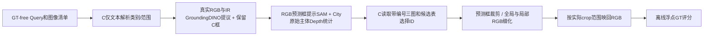

# TriGround 接手地图与审计事实表

日期：2026-09-27。用户将另行提供网页版 GPT Pro 审计，本次先建立独立源码与实验依据；**GPT Pro 逐条审计对照尚未开始**，不能把本报告称作已核查其结论。

## 起点和本轮改动范围

- 实际 Git 根：`F:/AIC/code`，分支 `audit/gpt-pro-20260927`，HEAD `29a7a692219cdf09015d8f8dcdb67f330ea4e2e9`。接手时工作树干净；未切换、重置、提交或推送。
- 读取本地 `F:/AIC/AGENTS.md`，根和代码仓库 `.gitignore` 已列入 AGENTS.md。本轮未修改 AGENTS.md。
- 已通过 `read_thread` 读取“主开发GPT6”最近接续与交付记录。老对话用于检索线索，正式结论回到源码、清单和预测。
- 本轮新增本目录的审计报告、阅读清单、CPU 复算脚本与结果，并增量更新 `code/HANDOFF.md`。生产源码、训练数据、标签、模型、原预测与历史研究快照不改动。
- 未连接云端、未启动 GPU/旧队列/定时任务、未下载新模型、未生成或上传比赛提交。

## 规则依据

`contest` 全部 41 文件已列目录。4 份正式正文已读：9 页赛题 PDF 全文提取并逐页渲染查看、2 份 HTML 正文、技术报告 DOCX 大纲。37 个网页附属 CSS/JS/图片等只做资源清单，不声称逐行审阅网页第三方库；任务示意图和指标公式通过 PDF 图像核对。记录见 `contest-inventory.json` 与 `contest-extracted/`。

按本地官方材料：

| 事实 | 官方位置 | 对本项目的约束 |
|---|---|---|
| 英文 Query 与 RGB/IR/Depth 输入，输出 RGB 归一化 xyxy | PDF 第2–3页 | 模型内部千分位坐标必须在提交前转为 0–1；输出目标模态不能混淆 |
| 主指标 ACC@0.5，IoU≥0.5；分母是全部 Query | PDF 第4页 | 解析失败不从分母剔除；mIoU、ACC@0.7为项目补充指标 |
| 官方原始深度是 uint16、毫米，小值近，0/过小无效 | PDF 第3页 | 不能自动推广到外部数据或已可视化 JPEG |
| 仅填写 bbox，其余字段保留；JSON 压缩为 ZIP | PDF 第6页 | 以官方输入原字段为提交模板；反向、越界、NaN、空框无效 |
| 开源/自研模型自主推理；不手工生成测试结果；测试数据不训练 | PDF 第7–8页 | 本轮代码审计与本地开发集复算不用于改写官方测试结果 |
| 初/复赛交预测；半决赛还交代码、模型环境和PDF技术报告 | PDF 第8–9页及DOCX | 本轮仅建立材料依据，不执行提交 |

HTML 保存文本存在部分环境版本数字丢失（例如 PyTorch “0及以上”）；PDF 第5页清楚写 2.0 及以上。环境推荐不是当前云端依赖锁。本报告没有联网更新赛程或解释新规则。

## 项目地图

### 当前有实验依据的原生多图 LoRA 路线

```mermaid
flowchart LR
  A[City原始浮点标签 / 外部数据与人审] --> B[prepare_qwen3vl_native_sft 等数据转换]
  B --> C[图像路径 + human提示 + assistant千分位框]
  C --> D[prepare_gu_diagnosis 显式安排1600次呈现]
  D --> E[run_qwen3vl_native_lora.sh / Qwen外部训练模块]
  E --> F[语言注意力LoRA检查点]
  F --> G[evaluate_pretrained_grounder / 原生三图推理]
  G --> H[parse_generated_bbox / 0到1 RGB框]
  H --> I[独立浮点GT评分 / 全412与逐题翻转]
```

准确调用位置与实际训练记录见 `execution-audit.md`；数据来源、人审和显式采样见 `data-audit.md`。当前 C/M2/G/U/B/G*/U* 不经过仓库早期 `MultiModalGrounder` 的自定义融合结构。外部 Qwen 训练包通过入口脚本动态导入；其云端完整安装包和二进制权重未在本轮重新审计。

### 最新冻结 C 的候选/细化路线

此路线没有权重更新。逐阶段源码、版本、分数和样本解释见 `aux-audit.md`。实测 v1 为 273/221；当前居中截边修正版仅 CPU 测试，不能给它套用 v1 成绩。

### 历史自定义融合路线

`configs/*.yaml → train.py → src/mm_grounding/data.py → MultiModalGrounder/适配器和融合器 → engine.py → evaluate.py/checkpoint.py`。完整阅读见 `core-audit.md`。它保留有训练和结构价值，但不是现行原生 LoRA 的调用链；旧 QueryTokenEncoder、旧正交公式、旧早停参数等问题不能直接用于解释 C292→221。

根 README 虽有最新审计提示，正文仍写“当前推荐五阶段”并给出旧依赖/Slurm 流程。阅读时以调用入口、版本和实际 run_config 判定，不能依标题把历史说明当成当前复现指南。

## 独立核实的事实表

| 项目 | 本轮核查结果 | 证据与边界 |
|---|---|---|
| City训练/验证 | 3707条/681图组；412条/78图组 | 实际 source_snapshot 清单复算。图像路径完全重合为0不代表地点独立 |
| 已知地点重用 | 47条，余365未证独立 | 与保存的已审47名单匹配；本轮没有重新目视全部地点 |
| RGBDT人工放行 | 181输出任务，98Query/98图组；RGB98、IR58、Depth25 | 两份各100项CSV联结到252候选：181放行、5拒绝、66待审 |
| B/G*/U*实际训练 | 每臂1600呈现、200更新；1200共同City位置 | 三份清单与逐条 consumed_samples 顺序一致；未读取云权重/优化器二进制 |
| G*↔U*新400位置 | 同图同ID同序；217条全同、183条变输出模态/提示及答案 | 183含IR128、Depth55，不能当400独立新Query |
| B额外数据混杂 | 98新City Query的98图组都已在共同1200出现 | B↔G*同时改变图像来源/熟悉度与Query，不是仅标签质量对照 |
| RGBT6000 / Robo2000 | 未出现在此三臂的实际采样 | 它们是已准备的外部池，不能默认每轮均使用；原图库存未逐张重验 |
| 官方复赛输入 | 本地JSON 5690条，全部无bbox字段 | Depth路径5515 PNG、175 JPG；见 official-input-check.json。后缀不等同于物理编码证明 |
| 官方成绩0.7144 | 仍标记为用户反馈 | 无官方GT，未登录平台核查，不能由本地412计算得到 |
| 最新候选覆盖 | 339；新增C错题覆盖47；已有覆盖仍选错66 | 独立按保留候选计算，不等于端到端准确率 |
| 局部细化映射 | 104数字输出映射误差0；53退化、1纠正 | 25个退化输出事后按全图解释可命中，仅诊断，未择优改分 |
| 预检行为 | 保存的train16按训练答案评分14→13→9 | 原16/16仅格式有效。训练内验收问题在正式412前已有信号 |

### 全412预测重算

| 模型/流程 | ACC@0.5命中 | ACC@0.7命中 | mIoU |
|---|---:|---:|---:|
| M2 | 285 | 214 | 0.598332 |
| C1500 | 292 | 224 | 0.613628 |
| 旧G200 | 288 | 203 | 0.594409 |
| 旧U200 | 283 | 202 | 0.596209 |
| B200 | 287 | 208 | 0.597816 |
| G*200 | 284 | 203 | 0.591390 |
| U*200 | 286 | 209 | 0.599480 |
| C＋候选选择 | 273 | 205 | 0.577475 |
| C＋选择＋细化v1 | 221 | 167 | 0.471095 |

全部以原浮点GT、412为分母；前7模型解析412/412，后两阶段411/412。结果来自本轮 CPU 重算旧预测，不是重新推理。C1500与200步三臂预算不同，C只作为最好参考；不能把与C的全部差额归给新增辅助监督。

## 等待 GPT Pro 的对照底表

尚未收到其正文，以下为后续判定依据而非对其观点的预判。

| 待核查命题 | 当前证据状态 | 后续判定要点 |
|---|---|---|
| 新数据实现了互补或关系推理 | 不成立为已证结论 | 对应监督与辅助必要性分开；不能按输出任务量计推理题 |
| 最新退化全因软件坐标换算错误 | 与逐题复算不符 | 算术误差0；模型坐标语义失效、目标身份与框范围分别查 |
| 修正裁剪已恢复成绩 | 尚无实验 | 必须注明当前修正版没有GPU成绩 |
| 候选ID绑定或GT候选导致当前结果 | 所查主链未发现证据 | 引具体数据/ID/执行文件，不能仅凭源码存在GT字段下结论 |
| 预检已经验证同对象局部定位 | 不成立 | check_complete只验格式和截断；14→13→9需行为验收 |
| SAM质量高即Depth可靠 | 不成立 | 内部数值规则与正确主体、人审/配准仍不同 |
| U*比G*高2题证明Depth起作用 | 证据不足 | 提示/输出任务同时变化；需固定条件对照与不确定性解释 |
| 旧融合缺陷解释当前原生LoRA成绩 | 调用链不支持 | 先证明真实运行过对应模块与配置 |

审计反馈到达后按“成立 / 部分成立需收窄 / 误读 / 尚需实验”逐条填入具体文件行、版本、样本ID、反例和最低成本验证。本轮不先决定重构路线，也不自动执行旧报告中的下一实验建议。

## 阅读与验证边界

逐文件覆盖汇总见 `coverage-summary.json`；模块记录分别为 `core-coverage.json`、`data-source-coverage.json`、`execution-coverage.json`、`main-coverage.json`，快照差异为 `aux-version-coverage.json`。源清单是203个项目源码/配置/脚本/测试文件、31861行；发布用 `release-manifest.json` 单独查看。历史审计包另有32个Python快照/构建脚本。

70份研究报告已建立标题/章节索引 `research-index.json`，**没有声称全部70份正文逐字读完**。主线程全文读了最新 aux 方法/审查/执行与 gu-deep-root-cause，其余由模块审阅相关内容或仅索引；日志、JSONL大量记录通过结构化复算访问，不等于逐条人工语义审阅。

本轮主线程额外目视2例、每例5张既有图册图片，并对其中1例从原始uint16与mask重算深度有效像素；没有重新审阅全部412图像、2443掩码、181人审目标或全部云模型。虚拟环境、权重、缓存、原始图像批量、`.work`历史临时脚本未全盘读取；`.work`已复制到审计包的12份标注构建脚本另行通读。

测试命令、结果和失败边界见各模块报告及 `validation.md`。CPU测试证明有限代码行为；不证明当前模型能可靠读Depth、选择同对象、遵守局部坐标或在官方集提分。
